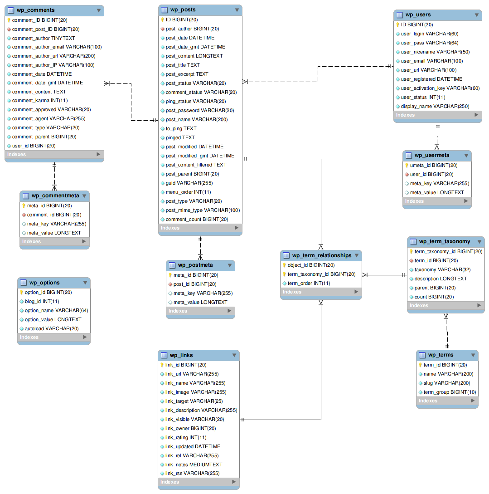

# FPM-CMS
A CMS System For FPM.

### Functions
- [ ] Write Posts/Pages
- [ ] Make A Site Setting
- [ ] Extend DataMeta

### RoadMap
- v0.0.1
  - [ ] Write Post
  - [ ] Edit Setting
  - [ ] Dashboard

- v0.0.2
  - [ ] RichEditor
  - [ ] Write Page

- v0.0.3
  - [ ] Tags
  - [ ] Categorys

- v0.0.4
  - [ ] Comments

- v0.0.5
  - [ ] Metadata

- v0.1.0
  - [ ] Add fpmc

### Changelog

### Snapshots
- [ ] ..

### Prototype
- [ ] At Modao.cc
  - [https://modao.cc/app/QVQaMYO4sdMe67xc9rJHRJDhZYLDEE5](https://modao.cc/app/QVQaMYO4sdMe67xc9rJHRJDhZYLDEE5)

### Database ER
- [ ] This is the wordpress database relationship
  - [ ] 

### Dev Stack

- [ ] React
- [ ] React-router-dom
- [ ] Element-React 
  - [ ] Docs: [https://elemefe.github.io/element-react/#/zh-CN/layout](https://elemefe.github.io/element-react/#/zh-CN/layout)

### About The CMS

- [ ] Post or Page
  - [ ] It contains basic infomations, include: `content, title, author, url, id, cover, excerpt` ...
  - [ ] We can extend the meta Use metadata manager .
  - [ ] It can be commented by users, trashed by admin or author, TOP or Star by the website admin.
- [ ] Metadata
  - [ ] Manager the meta info of the entity
  - [ ] Create UDF data entity
- [ ] Setting
  - [ ] set/get an [object...]
  - [ ] default settings as: `site title, domain, language` ...
  - [ ] 

### API
- [ ] post
  - [ ] list
    - [ ] Get list of the api, filter by `category, tag, author, state, title, content, url, id` ... , order by `viewers, newest, comments` ... .
    - [ ] Fields as `next page, prev page`

### TODO:
- [ ] upload
- [ ] richtext editor
- [ ] mock server